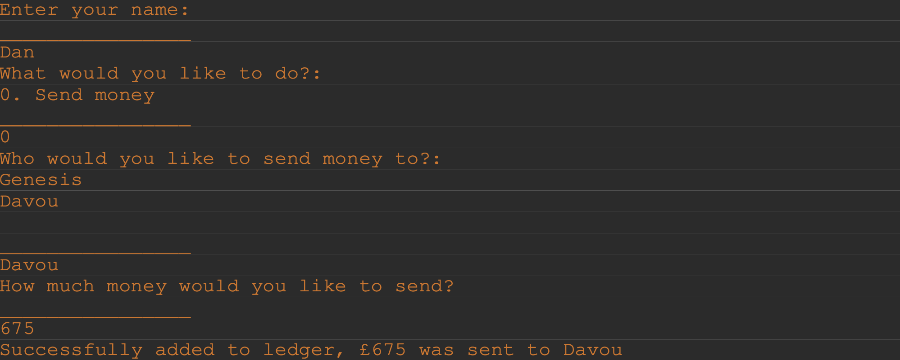
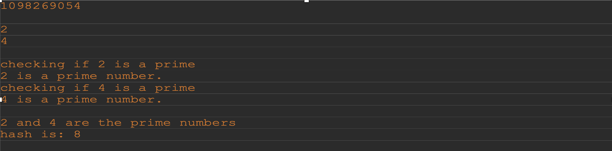
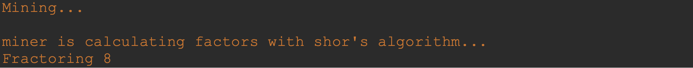

# Running Blockchain - Windows

## A simple ledger program intended to replicate the bitcoin blockchain.
Using the JQuantum library (https://github.com/chasenorman/JQuantum#jquantum), I demonstrated how quantum technology can decrypt RSA keys (on a small scale).
I replaced the normally used SHA256 encryption with RSA for each hash and used shor's algorithm to mine.
This is quite impractical, but was a fun way to demonstrate the ccapabilites of quantum computing and shor's algorithm in decyphering prime factors. 

## Table of Contents 

- [Deployment](#deployment)
- [Operation](#operation)
- [Credits](#credits)
- [License](#license)

## Deployment
This program is to be ran in terminal

Open up 3 tabs:

First tab - 
Firstly create a `rmiregistry` in the src directory

Second tab -
Then start the server begin by writing this line in the src directory:
- `javac -cp "../jQuantum-2.3.1.jar;../src" *.java`: compiles all files

Then run the server by writing this line in the src directory:
- `java -cp "../jQuantum-2.3.1.jar;../src" Ledger.java`: run the server

Third tab -
Then tun the client-side by writing this line:

- `java Client.java`: run the server

- `src`: the folder to maintain sources
- `lib`: the folder to maintain dependencies

The `JAVA PROJECTS` view allows you to manage your dependencies. More details can be found [here](https://github.com/microsoft/vscode-java-dependency#manage-dependencies).

## Operation

Before initiating the blockchain server, we will start by creating a rmiregistry in the terminal command line. Once this is done, in another command line we can compile all classes and run the Ledger class. This will begin the server and straight away an instance of Block will be created with the previous hash value being null. This block will be named genesisBlock and will generate an automatic transaction between Genesis and Davou to begin the chain.
While the backend is running, in another terminal, we can start a client-server. In doing so you will be asked to enter your name, who you would like to send money to and how much you would like to send said person. Upon entering this information, the backend will process the data and it will be appended onto the blockchain.

A significant amount is happening in the backend during this period. Once a new block has been requested and its transactional data, timestamp and nonce have been encrypted by SHA-256, we can hash it once more and generate a new semiprime hash. 
The procedure cannot be carried out the same way as described previously as it would generate numbers too large for a normal computer to handle, so I implemented a version that simplified the numbers until they were single digits. Fortunately, it doesn’t undermine the original procedure and relies on the same premise but with much smaller numbers.

These print statements depict SHA-256 messages converted into a large integer which is then split in two (in our case it is split in two and only the last digits are considered so we can run the algorithm). Both values are then checked to see if they are primes and if they are, will be multiplied to find the new hash. Unlike the numbers we are dealing with now, you wouldn’t be able to decipher ones that aren’t simplified unless you have a capable quantum machine.
Once this hash is created, it is returned from the Block method to the Ledger where it is placed as a parameter in the Shor main class. Once this happens, the Shor class begins “mining” the block.

This function works exactly the same as how the algorithm was described in previous chapters, thanks to JQuantum I had access to circuits and gates like the hadamap gate.
Once Shor has returned the two prime factors of the number, it is then validated within the Block, once this process is done, the block has been finally added.

## Credits

Source code created by Davou Jobbi.

Java Quantum Library https://github.com/chasenorman/JQuantum

## License

MIT License

Copyright (c) [2023] [Davou-Jobbi]

Permission is hereby granted, free of charge, to any person obtaining a copy
of this software and associated documentation files (the "Software"), to deal
in the Software without restriction, including without limitation the rights
to use, copy, modify, merge, publish, distribute, sublicense, and/or sell
copies of the Software, and to permit persons to whom the Software is
furnished to do so, subject to the following conditions:

The above copyright notice and this permission notice shall be included in all
copies or substantial portions of the Software.

THE SOFTWARE IS PROVIDED "AS IS", WITHOUT WARRANTY OF ANY KIND, EXPRESS OR
IMPLIED, INCLUDING BUT NOT LIMITED TO THE WARRANTIES OF MERCHANTABILITY,
FITNESS FOR A PARTICULAR PURPOSE AND NONINFRINGEMENT. IN NO EVENT SHALL THE
AUTHORS OR COPYRIGHT HOLDERS BE LIABLE FOR ANY CLAIM, DAMAGES OR OTHER
LIABILITY, WHETHER IN AN ACTION OF CONTRACT, TORT OR OTHERWISE, ARISING FROM,
OUT OF OR IN CONNECTION WITH THE SOFTWARE OR THE USE OR OTHER DEALINGS IN THE
SOFTWARE.

---